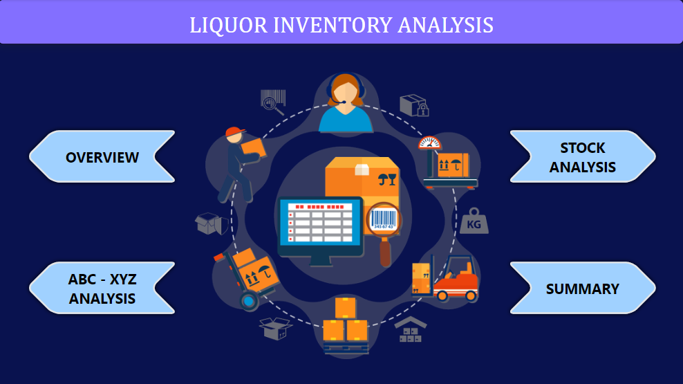
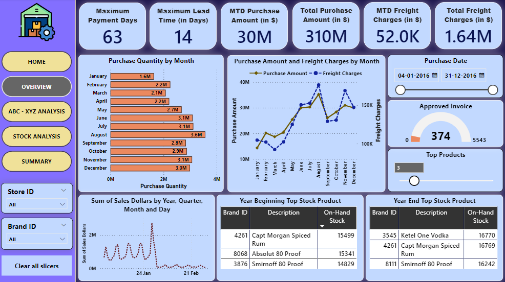
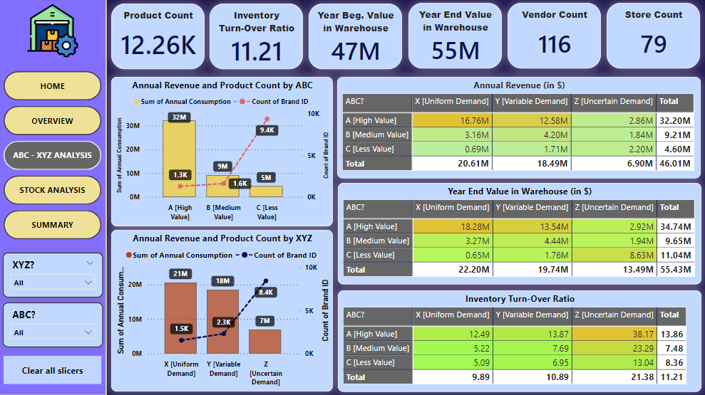
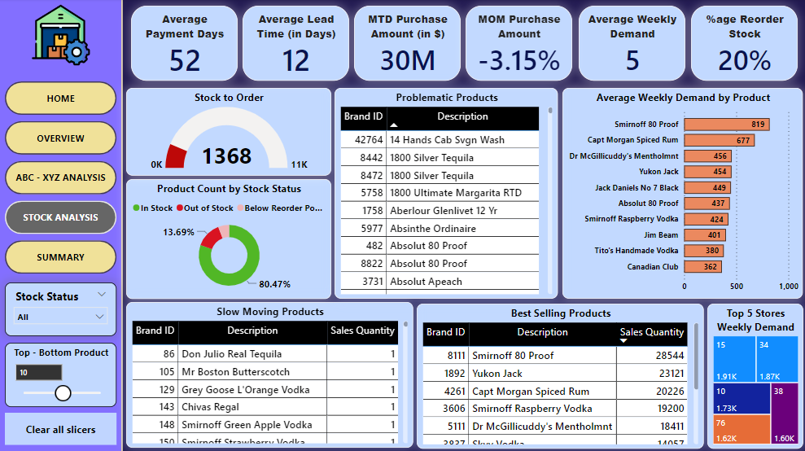
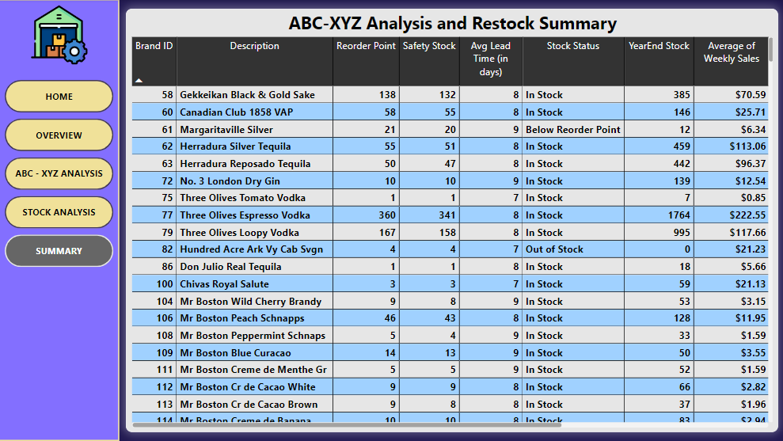
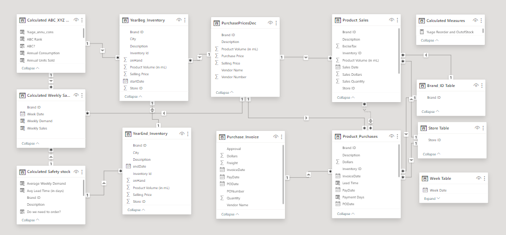

# Liquor Inventory Analysis Using Power BI and SQL

## Problem Statement
The merchandise xyz company buys a liquor from various vendors and sell it to their clients.
The company has been experiencing issues with inventory management, including stockouts, excess inventory, and increased carrying costs. 
The management team wants to conduct an inventory analysis to identify areas for improvement and optimize their inventory management practices  

## Tools Used
Power-BI, MySQL, MS PowerPoint

## Dataset Link
https://www.kaggle.com/datasets/bhanupratapbiswas/inventory-analysis-case-study/data

## Action
The analysis is centred on the following points :
1) Analysis of Purchase
2) Analysis of Sales
3) Analysis of Stocks 
4) ABC Evaluation
5) XYZ Evaluation

## Key Insights
1) Reorder and Out of Stock products segregated.
2) 13.69% products are Out of Stock at year end and 5.84% products are Below Reorder Point.
3) Sales data shows a seasonality pattern in the product sales.
4) Problematic products are identified whose per day sales is greater than max sales.
5) Uncertain demand products have high value in warehouse at year end which is problematic.
6) Products categorized as Z exhibit a high inventory turnover ratio which is problematic.
7) Products within the A category demonstrate high revenue performance, with particular emphasis on categories X and Y, which exhibit notably elevated revenue figures.

## Learnings
1) Get to know about ABC and XYZ inventory management techniques along with other inventory mangement term such as inventory turnover ratio, reorder point, etc.
2) Various DAX formulas
3) Dynamic Ranking

## Dashboard Screenshot

